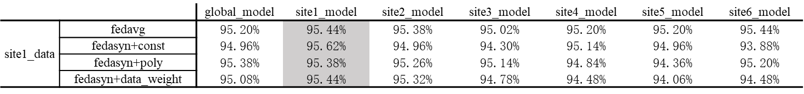
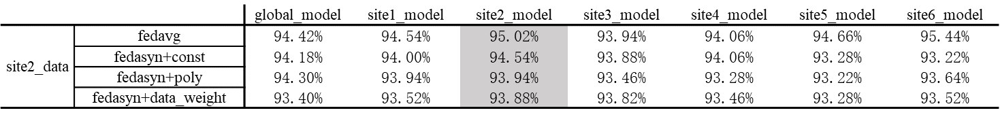
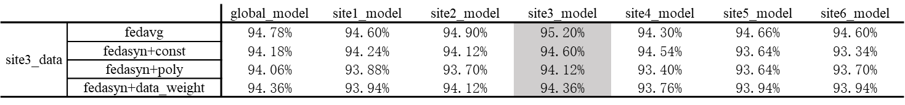
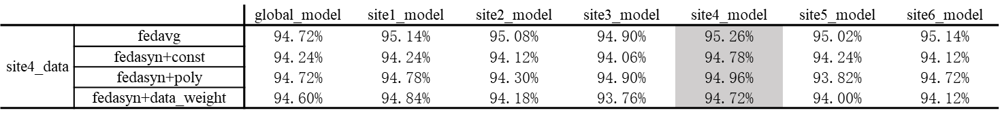
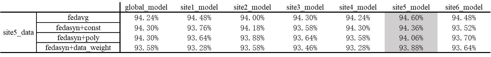
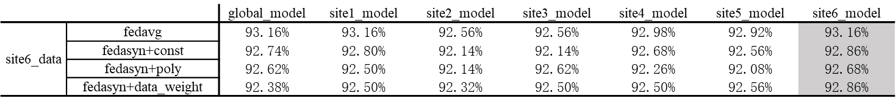
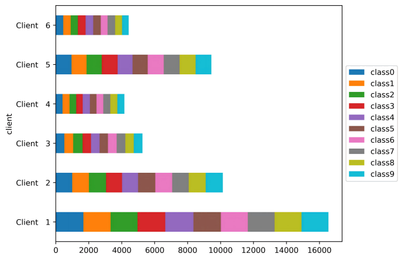
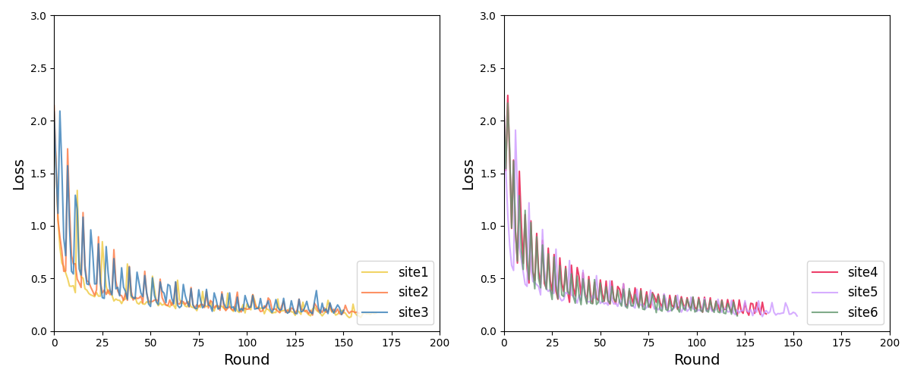

# Asynchronous Federated Learning Example

## Introduction
This example illustrates the implementation of asynchronous federated learning based on the NVFlare architecture. In asynchronous federated learning, each client can independently update its model and send it to the server without waiting for other clients. The server aggregates the global model and local models using weighted methods. This example provides three different methods for calculating aggregation weights: `constant`, `polynomial`, and `data_weighted`. In this example, we apply these methods to classify images from the CIFAR-10 dataset.

## Asynchronous Federated Learning Workflow
In asynchronous federated learning, the interaction between the server and clients is more flexible, allowing for continuous model updates without the need for synchronization. The workflow is as follows:

### Server-Side
>The server waits for local model updates from any client. Once it receives a model update from any client, it immediately performs weighted aggregation to generate a new global model.
The server then sends the updated global model parameters back to the corresponding client that provided the update.

### Client-Side
>Similar to synchronous federated learning, once any client receives the updated global model from the server, it immediately begins a new round of training using its local data.
After completing the training, the client uploads the updated model parameters to the server.


## Code Implementation

To implement asynchronous federated learning, this example replaces the original [scatter_and_gather](https://github.com/NVIDIA/NVFlare/blob/2.4/nvflare/app_common/workflows/scatter_and_gather.py), [intime_accumulate_model_aggregator](https://github.com/NVIDIA/NVFlare/blob/2.4/nvflare/app_common/aggregators/intime_accumulate_model_aggregator.py), [dxo_aggregator](https://github.com/NVIDIA/NVFlare/blob/2.4/nvflare/app_common/aggregators/dxo_aggregator.py) and [weighted_aggregation_helper](https://github.com/NVIDIA/NVFlare/blob/2.4/nvflare/app_common/aggregators/weighted_aggregation_helper.py) with [scatter_and_gather_async](jobs/app/custom/workflows/scatter_and_gather_async.py), [fedasync_aggregator](jobs/app/custom/aggregators/fedasync_aggregator.py),[dxo_async_aggregators](jobs/app/custom/aggregators/dxo_async_aggregator.py), and [async_aggregation_helper](jobs/app/custom/aggregators/async_aggregation_helper.py). The key changes include:


### [scatter_and_gather_async](jobs/app/custom/workflows/scatter_and_gather_async.py)
>&ensp;&ensp;To support asynchronous federated learning, we modified the workflow so that it's no longer necessary to wait for all clients to submit their local model parameters before aggregation. Specifically, we replaced the [broadcast_and_wait()](https://github.com/NVIDIA/NVFlare/blob/2.4/nvflare/app_common/workflows/scatter_and_gather.py#L253) method with the [send()](jobs/app/custom/workflows/scatter_and_gather_async.py#L283) method, allowing the server to send the updated global model to specified clients without blocking. However, it's important to note that in the first round (when current_round is equal to start_round), the [broadcast()](jobs/app/custom/workflows/scatter_and_gather_async.py#L261) method is used for broadcasting the training task to all clients.   
>&ensp;&ensp;Since both the `broadcast()` and `send()` are non-blocking,  it's necessary to wait until at least one client has uploaded its locally trained model parameters before starting the aggregation process.  
>&ensp;&ensp;Additionally, to ensure the global model is sent to the appropriate clients in an orderly manner, we store each client that participates in the aggregation sequentially in a queue, which is then used to determine the target clients to send updated global model to.


### [async_aggregation_helper](jobs/app/custom/aggregators/async_aggregation_helper.py)
> ● Modified `add()` :  
>&ensp;&ensp;In this file, the [add()](jobs/app/custom/aggregators/async_aggregation_helper.py#L47) function stores the results submitted by the client in a queue. Compared to the [add()](https://github.com/NVIDIA/NVFlare/blob/2.4/nvflare/app_common/aggregators/weighted_aggregation_helper.py#L47) in `the WeightedAggregationHelper`, this version of the function no longer weightedly accumulates the model parameters when accepting weights from clients.  

> ● Added `func_s()`:  
>&ensp;&ensp;[func_s()](jobs/app/custom/aggregators/async_aggregation_helper.py#L93) calculates the aggregation weight (see `get_result()` below). It initializes different aggregation methods with hyperparameters defined in `config_staleness.json`.

> ● Modified `get_result()` :  
>&ensp;&ensp;In asynchronous federated learning, the global model is updated according to the formula: $x_t \leftarrow (1 - \alpha_t) x_{t-1} + \alpha_t x_{new}$, where $\alpha_t$ is the aggregation weight calculated using `func_s()` and $x_t$ is global model at the $t$-th epoch stored on server. The method [`get_result()`](jobs/app/custom/aggregators/async_aggregation_helper.py#L69) aggregates the global and local models based on $\alpha_t$ and provides the aggregated model.  
 >&ensp;&ensp;This function returns the updated weights along with information about the clients that participated in the aggregation.


### [dxo_async_aggregators](jobs/app/custom/aggregators/dxo_async_aggregator.py)

> ● Modified `accept()` :  
>&ensp;&ensp;Round correspondence checking for the submitted model is removed from the [accept()](https://github.com/NVIDIA/NVFlare/blob/2.4/nvflare/app_common/aggregators/dxo_aggregator.py#L70) implementation in the `dxo_aggregator`. The [accpet()](jobs/app/custom/aggregators/dxo_async_aggregator.py#L68) method now calls `add()` function from a new class `AsyncAggregationHelper` to store the information of the submitting client.

> ● Modified `aggregate()` :  
>&ensp;&ensp;Two new parameters are added to the original [aggregate()](https://github.com/NVIDIA/NVFlare/blob/2.4/nvflare/app_common/aggregators/dxo_aggregator.py#L164) : `global_model` and `config_staleness_filename`. [aggregate()](jobs/app/custom/aggregators/dxo_async_aggregator.py#L161) now calls `get_result()` from `AsyncAggregationHelper` to obtain the updated model and the information about the clients that participated in the aggregation.


### [fedasync_aggregator](jobs/app/custom/aggregators/fedasync_aggregator.py)

> ● Modified `accept()` :  
>&ensp;&ensp;Based on the original [accept()](https://github.com/NVIDIA/NVFlare/blob/2.4/nvflare/app_common/aggregators/intime_accumulate_model_aggregator.py#L165) in `InTimeAccumulateWeightedAggregator`, a few lines of codes are added in the modified [accept()](jobs/app/custom/aggregators/fedasync_aggregator.py#L165) to track the number of training rounds for each client. 

> ● Modified `aggregate()` :  
>&ensp;&ensp;Add a new parameter, `global_model`, to the original [aggregate()](https://github.com/NVIDIA/NVFlare/blob/2.4/nvflare/app_common/aggregators/intime_accumulate_model_aggregator.py#L223). [aggregate()](jobs/app/custom/aggregators/fedasync_aggregator.py#L233) now calls the `aggregate()`  from the `DXOAsyncAggregator` to obtain the updated model and the names of the clients that participated in the aggregation.

## Install requirements

Install required packages for training

```bash
pip install -r ./requirements.txt
```

##  Download and split the CIFAR-10 dataset

We use [FedLab](https://github.com/SMILELab-FL/FedLab) to split the CIFAR-10 dataset. After splitting the data, the proportion of data allocated to each client is calculated and saved into `config_staleness.json` with key `weights`.

```bash
python jobs/app/custom/data/data_splitter.py --num_clients 6 --balance True
```

> **_NOTE:_** This script supports both `balance_iid` (balanced IID) and `unbalance_iid` (unbalanced IID) data splits. To toggle between them, use the `balance` argument: set `balance=True` for balanced IID data split, and set `balance=False` for unbalanced IID data split. You can also specify the number of clients with the argument `num_clients`.

## Run simulated FL experiments

We are using NVFlare's FL simulator to run the experiments.

### Prepare  configs

This example is a modification based on the [hello-pt](https://github.com/NVIDIA/NVFlare/tree/2.4/examples/hello-world/hello-pt) example. Changes are made to some parameter settings in `config_fed_client.json` and `config_fed_server.json`, and an additional [`config_staleness.json`](jobs/app/config/config_staleness.json). This additional configuration file includes four key parameters: `staleness`, `alpha`, `a`, and `weights`.

> * `staleness`: There are three options for staleness calculation, namely, `constant`, `poly`, and `data_weighted`.  
> * `alpha, a`: These are hyperparameters used in the staleness calculation formulas.  
> * `weights`: This parameter is automatically populated when running the `data_splitter.py`, reflecting the data distribution among clients.

The specific formulas for calculating staleness are as follows:

```math
\begin{aligned}
&{\rm Constant}: &&s(t-\tau) = \alpha\\

&{\rm Data\_weight}: &&s(t-\tau) = \frac{client\_ data}{total\_ data} \\

&{\rm Polynomial}: &&s(t-\tau) = \alpha(t-\tau+1)^{-a}
\end{aligned}
```

Here, $t$ represents the current (global) round in the federated learning process, and $\tau$ denotes the round at which the client last updated its local model.  

For example, if you want to make staleness constant, you can modify the `config_staleness.json` in the following way:

```json
{
  "staleness": "const",
  "alpha": 0.5,
  ......
}
```

If you want to use the `poly` function to calculate staleness, you can modify the `config_staleness.json` in the following way:

```json
{
  "staleness": "poly",
  "alpha": 0.5,
  "a": 0.5
  ......
}
```


### Use NVFlare simulator to run the experiments

In this example, we run six clients on 2 GPU (NVIDIA RTX 4090 with 24 GB memory) with six threads `-t 6`. We put the workspace in `/tmp` folder.

```
nvflare simulator -w /tmp/nvflare/ -n 6 -t 6 -gpu 0,0,0,1,1,1 jobs
```
 **_NOTE:_**  The arguments after `-n` in this command need to be consistent with `num_client` in `data_splitter.py`


## Results on six clients for FedAsync
In this experiment, we studied two methods for partitioning the CIFAR-10 dataset over six clients: `balance_iid` and `unbalance_iid`. For the test set, the balance_iid partitioning method was consistently applied. The default settings for all experiments were set to 180 rounds (num_round=180) and a learning rate of 0.01 (lr=0.001).

### Testing scores
Under the `balance_iid` data partitioning method, the results of cross site evaluation are as follows:














> Grids in shadow are personalized results, i.e., results for local models tested on local test sets.
> 
> *For fedasync+const,we take `α=0.5` .For fedasync+poly,we take `α=0.5`,`a=0.5`.*

### Loss curve on each site
When the CIFAR-10 dataset is partitioned using the `unbalance_iid` method, the number of images per class in each client's data is shown in the figure below.



The loss curves presented here are obtained using the `fedasync+data_weighted`.




